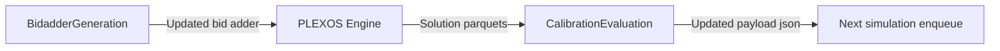

# Workflow: Iterative bid adder calibration using net load inputs and price convergence checks

## Usecase
You need to calibrate bid adder markups so your PLEXOS model produces an average Region price near a target value. Your inputs include a net-load Excel file stored in DataHub and an existing bid adder file inside the model’s `timeseries.zip` under `{simulation_path}`. After each run, you want an automated check of solution parquet outputs and (if needed) an automatic re-run with adjusted calibration settings.

## Problem
Without automation, you manually download net-load inputs, edit bid adder files, repackage `timeseries.zip`, run PLEXOS, then extract and join solution parquets to compute average prices. This is slow and error-prone: small mistakes in zip paths, band settings, or iteration tracking can invalidate results and waste compute time. It also makes iterative calibration difficult to reproduce because the “next run” settings are often tracked outside the simulation payload.

## Data Flow Diagram


## Scripts Involved

| Order | Script | Phase | Purpose | Key Arguments |
|---:|---|---|---|---|
| 1 | [BidadderGeneration](../Pre/PLEXOS/BidadderGeneration/README.md) | Pre | Download net-load Excel from DataHub, generate markup from net-load curve, and update the bid adder inside `timeseries.zip` for the upcoming run. | `--netload-file`, `--bidadder-filename`, `--counter`, `--bands`, `--seasonal-weights`, `--timeseries-subdir`, `--local-mode` |
| 2 | [CalibrationEvaluation](../Post/PLEXOS/CalibrationEvaluation/README.md) | Post | Query solution parquets for Region price, check convergence vs threshold and margin, and enqueue the next iteration by updating and re-uploading the simulation payload JSON. | `--simulation-file-path`, `--threshold-value`, `--margin`, `--counter`, `--pre-task-name`, `--post-task-name`, `--pre-script-name`, `--post-script-name` |

## Complete Task Definition
```json
[
  {
    "Name": "generate_bid_adder",
    "TaskType": "Pre",
    "Files": [
      {
        "Path": "Pre/PLEXOS/BidadderGeneration/bid_adder_generation.py",
        "Version": null
      },
      {
        "Path": "requirements.txt",
        "Version": null
      }
    ],
    "Arguments": "python3 bid_adder_generation.py --bands \"0.0:0,0.6:0,0.8:25,0.9:125,1.0:225\" --seasonal-weights \"1:0.50,2:0.55,3:1.30,4:1.50,5:1.57,6:1.30,7:1.40,8:1.47,9:1.10,10:1.15,11:1.10,12:1.05\" --counter 0 --bidadder-filename Plexos_Markup_Adders_AllGenerators-2027.csv --netload-file calibration/inputs/Netload_2027.xlsx --timeseries-subdir \"TimeSeries/Bid Adders\"",
    "ContinueOnError": false,
    "ExecutionOrder": 1
  },
  {
    "Name": "evaluate_results",
    "TaskType": "Post",
    "Files": [
      {
        "Path": "Post/PLEXOS/CalibrationEvaluation/calibration_evaluation.py",
        "Version": null
      },
      {
        "Path": "requirements.txt",
        "Version": null
      }
    ],
    "Arguments": "python3 calibration_evaluation.py --threshold-value 80.0 --simulation-file-path calibration/payloadjson/payload.json --counter 0 --margin 0.05 --pre-task-name generate_bid_adder --post-task-name evaluate_results --pre-script-name bid_adder_generation.py --post-script-name calibration_evaluation.py",
    "ContinueOnError": false,
    "ExecutionOrder": 2
  }
]
```

## Step-by-Step Walkthrough

### 1) BidadderGeneration (Pre)
This step prepares the next PLEXOS run by modifying an existing bid adder file (CSV or XLSX) that lives under `{simulation_path}` and is packaged inside `timeseries.zip`. It downloads the net-load Excel file from DataHub (unless `--local-mode` is set), computes a normalized net-load curve, applies piecewise-linear bands and monthly seasonal weights, and writes the updated bid adder back into `timeseries.zip`.

**Inputs**
- DataHub net-load Excel file specified by `--netload-file` (cloud mode).
- Existing bid adder file specified by `--bidadder-filename` located under `{simulation_path}/{timeseries-subdir}` and inside `timeseries.zip`.

**Outputs**
- Updates `timeseries.zip` in-place under `{simulation_path}` so the PLEXOS engine uses the modified bid adder.
- Copies the modified bid adder file to `{output_path}` for downstream inspection and traceability.

**Environment variables**
- `cloud_cli_path` (required)
- `simulation_path` (optional, default `/simulation`)
- `output_path` (optional, default `/output`)

**Failure behavior**
- If the DataHub download fails (bad path, auth, CLI not found), the task fails and the simulation should not proceed.
- If the bid adder file cannot be found in the expected `{simulation_path}` subdirectory or zip entry prefix, the task fails and no calibration run occurs.

### 2) PLEXOS Engine (Simulation)
The PLEXOS engine runs using the updated `timeseries.zip` produced by the pre-task. This workflow assumes your simulation is configured to produce solution parquet outputs under `{simulation_path}`.

**Inputs**
- Updated `timeseries.zip` under `{simulation_path}`.

**Outputs**
- Solution parquet files under `{simulation_path}` (used by the post-task), including the solution parquet set referenced by the evaluator (data, fullkeyinfo, period).

**Failure behavior**
- If the simulation fails or does not produce the expected parquet outputs, the post-task will fail when it cannot locate or query the solution data.

### 3) CalibrationEvaluation (Post)
This step evaluates whether the run meets your calibration target. It locates solution parquet outputs under `{simulation_path}`, uses DuckDB to join/filter for Region price data, computes the average price, and checks whether it is within `--threshold-value` ± `--margin`.

If the run is not converged, it downloads the simulation payload JSON from DataHub (`--simulation-file-path`), updates it for the next iteration (including incrementing the counter and updating task/script metadata), and enqueues the next simulation via the Cloud SDK. The loop is capped (up to 3 iterations).

**Inputs**
- Solution parquets under `{simulation_path}`.
- Simulation payload JSON in DataHub specified by `--simulation-file-path`.

**Outputs**
- Staged parquet/query artifacts written under `{output_path}` (working directory).
- Updated payload JSON written under `{output_path}` and used to enqueue the next simulation iteration when needed.

**Environment variables**
- `duck_db_path` (required)
- `output_path` (required)
- `cloud_cli_path` (required)
- `simulation_path` (optional, default `/simulation`)

**Failure behavior**
- If DuckDB cannot open the database at `duck_db_path`, the task fails and no retry is enqueued.
- If the payload JSON cannot be downloaded from DataHub, the task fails and the loop cannot continue.
- If enqueue fails, the task fails after evaluation (your run is evaluated, but the next iteration is not scheduled).

For SDK call details and parameter conventions, see [CloudSDK](../Documentation/CloudSDK.md).

## Data Flow Between Steps

### Step 1 to Simulation
- **Writes:** Updated bid adder content back into `{simulation_path}/timeseries.zip` using the zip entry prefix from `--timeseries-subdir` (default `TimeSeries/Bid Adders`).
- **Also writes:** A copy of the modified bid adder file to `{output_path}` (same base filename as `--bidadder-filename`).
- **Reads next:** The PLEXOS engine reads `timeseries.zip` from `{simulation_path}` during simulation startup.

### Simulation to Step 2
- **Writes:** Solution parquet outputs under `{simulation_path}` (the evaluator expects the solution parquet set that includes data, fullkeyinfo, and period).
- **Reads next:** `CalibrationEvaluation` searches `{simulation_path}` for those parquet files, then stages filtered results under `{output_path}` for its DuckDB query workflow.

### Step 2 to Next Iteration
- **Writes:** An updated simulation payload JSON under `{output_path}` after downloading the original from DataHub via `--simulation-file-path`.
- **Enqueues:** A new simulation iteration via `simulation.enqueue_simulation` when the average price is outside the acceptable margin and the max iteration limit has not been reached.

## Troubleshooting

| Symptom | Cause | Fix |
|---|---|---|
| Pre-task fails with DataHub download error | `cloud_cli_path` is missing/incorrect, or `--netload-file` points to a non-existent DataHub path | Set `cloud_cli_path` to the Cloud CLI executable path and verify the DataHub path in `--netload-file` (for example `calibration/inputs/Netload_2027.xlsx`). |
| Pre-task completes but simulation does not reflect updated adders | `--bidadder-filename` or `--timeseries-subdir` does not match the file location and zip entry prefix used in `timeseries.zip` | Confirm the bid adder file exists under `{simulation_path}/{timeseries-subdir}` and that the same subdirectory is used inside `timeseries.zip`. |
| Post-task fails to find solution parquets | Simulation did not produce parquet outputs under `{simulation_path}`, or outputs are in a different location | Ensure your PLEXOS run is configured to write solution parquets and that they are present under `{simulation_path}` before the post-task runs. |
| Post-task fails with DuckDB open or query errors | `duck_db_path` is missing/invalid, or the parquet set is incomplete (missing data, fullkeyinfo, or period) | Set `duck_db_path` to a valid writable location and confirm the solution parquet set exists and is complete under `{simulation_path}`. |
| Post-task evaluates but does not enqueue a retry when expected | `--simulation-file-path` is wrong, payload download fails, or enqueue fails due to permissions | Verify the DataHub path in `--simulation-file-path` (for example `calibration/payloadjson/payload.json`) and confirm the runtime identity has permission to download from DataHub and enqueue simulations. |