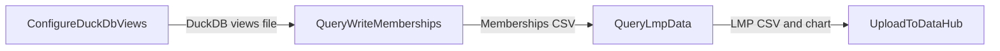

# Workflow: Generate generation weighted LMP reports from PLEXOS results and upload them to DataHub

## Usecase
You have a completed PLEXOS cloud simulation that produced solution Parquet outputs and a `reference.db` model database under `{simulation_path}`. You want repeatable post-processing that (1) creates queryable DuckDB views over the solution Parquet, (2) exports model memberships for zone mapping, (3) calculates generation-weighted LMP outputs, and (4) uploads the resulting CSV and optional chart artifacts to a DataHub folder for sharing and downstream analytics.

## Problem
Without automation, you typically have to manually locate the solution Parquet directory, write ad-hoc SQL to read many Parquet partitions, extract memberships from `reference.db`, and then stitch everything together to compute generation-weighted LMPs. This is slow to repeat across scenarios, easy to misconfigure (wrong Parquet path, missing memberships, inconsistent filters), and often results in outputs that are not consistently named or uploaded to the correct DataHub location.

## Data Flow Diagram


## Scripts Involved

| Order | Script | Phase | Purpose | Key Arguments |
|---:|---|---|---|---|
| 1 | [ConfigureDuckDbViews](../Post/PLEXOS/ConfigureDuckDbViews/README.md) | Post | Create DuckDB views over solution Parquet folders so later steps can query solution data consistently. | `--verbose` |
| 2 | [QueryWriteMemberships](../Post/PLEXOS/QueryWriteMemberships/README.md) | Post | Export PLEXOS membership relationships from `{simulation_path}/reference.db` to a CSV in `{output_path}`. | `--output-file` |
| 3 | [QueryLmpData](../Post/PLEXOS/QueryLmpData/README.md) | Post | Join solution views with memberships and a technology lookup CSV to compute generation-weighted LMP outputs to `{output_path}`. | `--tech-lookup-file`, `--memberships-file`, `--period-type`, `--phase`, `--graph-date` |
| 4 | [UploadToDataHub](../Automation/PLEXOS/UploadToDataHub/README.md) | Automation | Upload the staged CSV and PNG artifacts from `{output_path}` to a DataHub results folder. | `--cli-path`, `--environment`, `--directory`, `--pattern`, `--datahub-path`, `--versioned` |

## Complete Task Definition
```json
[
  {
    "Name": "Configure DuckDB Solution Views",
    "TaskType": "Post",
    "Files": [
      {
        "Path": "Post/PLEXOS/ConfigureDuckDbViews/configure_duck_db_views.py",
        "Version": null
      }
    ],
    "Arguments": "python3 configure_duck_db_views.py --verbose",
    "ContinueOnError": false,
    "ExecutionOrder": 1
  },
  {
    "Name": "Query Write Memberships",
    "TaskType": "Post",
    "Files": [
      {
        "Path": "Post/PLEXOS/QueryWriteMemberships/query_write_memberships.py",
        "Version": null
      }
    ],
    "Arguments": "python3 query_write_memberships.py --output-file memberships_data.csv",
    "ContinueOnError": false,
    "ExecutionOrder": 2
  },
  {
    "Name": "Query LMP Data",
    "TaskType": "Post",
    "Files": [
      {
        "Path": "Post/PLEXOS/QueryLmpData/query_lmp_data.py",
        "Version": null
      },
      {
        "Path": "Post/PLEXOS/QueryLmpData/plexos_pso_tech_lookup.csv",
        "Version": null
      }
    ],
    "Arguments": "python3 query_lmp_data.py --tech-lookup-file plexos_pso_tech_lookup.csv --memberships-file memberships_data.csv --period-type Interval --phase ST --graph-date 2024-01-15",
    "ContinueOnError": false,
    "ExecutionOrder": 3
  },
  {
    "Name": "Upload LMP Results to DataHub",
    "TaskType": "Post",
    "Files": [
      {
        "Path": "Automation/PLEXOS/UploadToDataHub/upload_to_datahub.py",
        "Version": null
      }
    ],
    "Arguments": "python3 upload_to_datahub.py --cli-path /path/to/cli/plexos-cloud --environment <your-environment> --directory {output_path} --pattern \"*.csv\" --datahub-path Project/Study/Results/LMP --versioned",
    "ContinueOnError": true,
    "ExecutionOrder": 4
  }
]
```

## Step-by-Step Walkthrough

### 1) ConfigureDuckDbViews
- What it does: Creates `CREATE OR REPLACE VIEW` entries in a DuckDB file so each solution Parquet subdirectory can be queried as a view.
- What it reads:
  - `directory_map_path` (optional) to locate the directory mapping JSON; if not set, it falls back to `{simulation_path}/splits/directorymapping.json`.
  - The mapping JSON must contain at least one entry with a `ParquetPath` field; the script uses the first such entry.
- What it writes:
  - A DuckDB database file at `duck_db_path` containing the views (platform default is `/output/solution_views.ddb`, but you must ensure `duck_db_path` is set in the runtime environment).
- Environment variables:
  - Required: `duck_db_path`
  - Optional: `directory_map_path`
- Failure behavior:
  - Exits with code `1` if `duck_db_path` is missing, the mapping file cannot be found, the mapping is empty/malformed, or no `ParquetPath` entry exists. Downstream steps will fail because required solution views will be missing.

### 2) QueryWriteMemberships
- What it does: Queries `{simulation_path}/reference.db` (SQLite) via DuckDB and exports membership relationships to a CSV for later joins (e.g., mapping generators to zones).
- What it reads:
  - `{simulation_path}/reference.db`
- What it writes:
  - `{output_path}/memberships_data.csv` (or the filename you set via `--output-file`)
- Environment variables:
  - Optional (defaults apply): `simulation_path`, `output_path`
- Failure behavior:
  - Exits with code `1` if `reference.db` is missing, DuckDB cannot load the SQLite extension, the query fails, or the CSV cannot be written. If this step fails, the LMP query step will not find the memberships CSV.

### 3) QueryLmpData
- What it does: Reads the DuckDB solution views, joins them with:
  - a technology classification CSV (`--tech-lookup-file`), and
  - the memberships CSV (`--memberships-file`),
  then calculates generation-weighted LMP by zone and exports reports to `{output_path}`. If `--graph-date` is provided, it may also generate a PNG chart.
- What it reads:
  - `duck_db_path` DuckDB file created/updated in step 1
  - Technology lookup CSV from `--tech-lookup-file`
    - If you pass a plain filename, it is resolved relative to `simulation_path`
  - Memberships CSV from `--memberships-file`
    - If you pass a plain filename, it is resolved relative to `output_path`
- What it writes (to `{output_path}`):
  - `gen_weighted_lmp_{YYYYMMDD_HHMMSS}.csv`
  - `generation_by_generator_{YYYYMMDD_HHMMSS}.csv`
  - `gen_by_fuel_{YYYY-MM-DD}.png` (only when `--graph-date` is provided; it warns and skips if no matching data)
- Environment variables:
  - Required: `duck_db_path`, `output_path`
  - Optional: `simulation_path`
- Failure behavior:
  - Exits with code `1` if required env vars are missing, the tech lookup file is not found, the memberships file is not found, `--graph-date` is invalid, or required solution views are missing (typically indicating step 1 did not run successfully).

### 4) UploadToDataHub
- What it does: Uploads files from a local directory (here, `{output_path}`) to a DataHub folder using the PLEXOS Cloud CLI and the Cloud SDK.
- What it reads:
  - Files matched by `--pattern` under `--directory` (for this workflow, CSV outputs in `{output_path}`)
- What it writes:
  - Uploads the selected files to the DataHub path specified by `--datahub-path` with their original filenames.
- Environment variables:
  - None.
- Failure behavior:
  - Exits with code `1` if the CLI path is invalid, authentication fails, no files are specified, or uploads fail. In this workflow the task is configured with `ContinueOnError: true` so a transient upload issue does not mark the overall post chain as failed.

## Data Flow Between Steps

- Step 1 → Step 2
  - No file dependency between these steps. Step 1 produces/updates the DuckDB file at `duck_db_path`; step 2 independently reads `{simulation_path}/reference.db`.
- Step 2 → Step 3
  - Step 2 writes `{output_path}/memberships_data.csv`.
  - Step 3 expects the memberships CSV specified by `--memberships-file`. If you pass a plain filename (recommended here), it is resolved under `{output_path}`.
- Step 1 → Step 3
  - Step 1 writes the DuckDB database at `duck_db_path` containing solution views over Parquet.
  - Step 3 connects to `duck_db_path` and expects solution views to exist (for example, views corresponding to solution tables such as `fullkeyinfo`, `data`, `period`, `object`, `category`).
- Step 3 → Step 4
  - Step 3 writes timestamped CSVs to `{output_path}`:
    - `gen_weighted_lmp_*.csv`
    - `generation_by_generator_*.csv`
  - If `--graph-date` is used and data exists for that date, it also writes `gen_by_fuel_YYYY-MM-DD.png`.
  - Step 4 uploads files selected by `--pattern` from `{output_path}`. If you also want PNGs, run UploadToDataHub with `--pattern "*.png"` (as a separate task) or change the pattern to `**/*` and manage what gets uploaded by directory hygiene.

## Troubleshooting

| Symptom | Cause | Fix |
|---|---|---|
| ConfigureDuckDbViews exits with code 1 immediately | `duck_db_path` is not set in the runtime environment | Ensure `duck_db_path` is provided by your platform configuration so the script can create the DuckDB file. |
| ConfigureDuckDbViews fails with mapping not found | `directory_map_path` not set and `{simulation_path}/splits/directorymapping.json` does not exist | Provide `directory_map_path` pointing to the mapping JSON, or ensure the default mapping file exists in the simulation outputs. |
| QueryWriteMemberships fails with “reference.db not found” | `{simulation_path}` is wrong or the simulation did not produce `reference.db` in the expected location | Verify `{simulation_path}` and confirm `{simulation_path}/reference.db` exists for the run you are post-processing. |
| QueryWriteMemberships fails due to invalid output filename | `--output-file` includes path separators or an absolute path | Use a plain filename only (for example `memberships_data.csv`); the script writes it under `{output_path}`. |
| QueryLmpData fails with “tech lookup file not found” | `--tech-lookup-file` is a plain filename but the file is not present under `{simulation_path}` | Place the CSV under `{simulation_path}` or pass an absolute path to `--tech-lookup-file`. |
| QueryLmpData fails with “memberships file not found” | Step 2 did not run, failed, or wrote a different filename than step 3 expects | Ensure step 2 succeeded and that `--memberships-file` matches the CSV name written to `{output_path}`. |
| QueryLmpData fails with missing solution views | Step 1 did not run successfully, or the directory mapping did not point at the correct Parquet solution directory | Re-run step 1 with correct mapping; confirm the mapping JSON contains a valid `ParquetPath` for the solution Parquet outputs. |
| UploadToDataHub fails with authentication error | Wrong `--environment` value or missing credentials for the CLI | Confirm the environment name is correct and that the CLI is authenticated for your user/session. See [CloudSDK](../Documentation/CloudSDK.md) for SDK context. |
| UploadToDataHub runs but uploads nothing | `--pattern` does not match the generated files | Check the actual filenames in `{output_path}` (timestamped `gen_weighted_lmp_*.csv`, `generation_by_generator_*.csv`) and adjust `--pattern` accordingly (for example `--pattern "*.csv"`). |