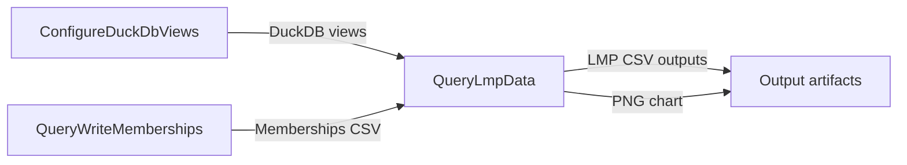

# Workflow: Generate generation weighted LMP reports and an hourly generation chart from PLEXOS solution parquet

## Usecase
You have a completed PLEXOS run where solution outputs have been written as Parquet under the solution directory referenced by `{simulation_path}/splits/directorymapping.json`. You want repeatable post-processing that produces generation-weighted LMP by zone, plus an optional hourly generation-by-fuel chart for a specific date, and stages all artifacts in `{output_path}` for downstream use.

This workflow chains three Post tasks: create DuckDB views over the solution Parquet, export model memberships from `reference.db`, then query and export LMP analytics using both the solution views and the memberships.

## Problem
Without automation, you typically:
- Manually locate the correct solution Parquet directory (which can vary by run and split configuration).
- Hand-build SQL or ad-hoc notebooks to join solution series with model structure (memberships) and technology mappings.
- Re-run analysis with inconsistent filters (phase, period type) and inconsistent file naming, making results hard to compare across runs.

That manual process is slow, error-prone, and difficult to standardize across studies and environments.

## Data Flow Diagram


## Scripts Involved

| Order | Script | Phase | Purpose | Key Arguments |
|---:|---|---|---|---|
| 1 | [ConfigureDuckDbViews](../Post/PLEXOS/ConfigureDuckDbViews/README.md) | Post | Create DuckDB views that point at solution Parquet subdirectories | `--verbose` |
| 2 | [QueryWriteMemberships](../Post/PLEXOS/QueryWriteMemberships/README.md) | Post | Export PLEXOS membership relationships from `{simulation_path}/reference.db` to CSV in `{output_path}` | `--output-file` |
| 3 | [QueryLmpData](../Post/PLEXOS/QueryLmpData/README.md) | Post | Compute generation-weighted LMP by zone using solution views, memberships CSV, and a technology lookup CSV; optionally generate an hourly chart | `--tech-lookup-file`, `--memberships-file`, `--period-type`, `--phase`, `--graph-date` |

## Complete Task Definition
```json
[
  {
    "Name": "Configure DuckDB Solution Views",
    "TaskType": "Post",
    "Files": [
      {
        "Path": "Post/PLEXOS/ConfigureDuckDbViews/configure_duck_db_views.py",
        "Version": null
      }
    ],
    "Arguments": "python3 configure_duck_db_views.py --verbose",
    "ContinueOnError": false,
    "ExecutionOrder": 1
  },
  {
    "Name": "Export Membership Data",
    "TaskType": "Post",
    "Files": [
      {
        "Path": "Post/PLEXOS/QueryWriteMemberships/query_write_memberships.py",
        "Version": null
      }
    ],
    "Arguments": "python3 query_write_memberships.py --output-file memberships_data.csv",
    "ContinueOnError": false,
    "ExecutionOrder": 2
  },
  {
    "Name": "Query LMP Data with Chart",
    "TaskType": "Post",
    "Files": [
      {
        "Path": "Post/PLEXOS/QueryLmpData/query_lmp_data.py",
        "Version": null
      },
      {
        "Path": "Post/PLEXOS/QueryLmpData/plexos_pso_tech_lookup.csv",
        "Version": null
      }
    ],
    "Arguments": "python3 query_lmp_data.py --tech-lookup-file plexos_pso_tech_lookup.csv --memberships-file memberships_data.csv --period-type Interval --phase ST --graph-date 2024-01-15",
    "ContinueOnError": false,
    "ExecutionOrder": 3
  }
]
```

## Step-by-Step Walkthrough

### 1) ConfigureDuckDbViews
**What it does:** Creates `CREATE OR REPLACE VIEW` entries in a DuckDB file (at `duck_db_path`) so you can query solution Parquet outputs as tables. It finds the solution Parquet root by reading the first `ParquetPath` entry in the directory mapping JSON.

**Reads:**
- `directory_map_path` (optional). If not set, it falls back to `{simulation_path}/splits/directorymapping.json` (as described in the script README).
- The solution Parquet directory referenced by `ParquetPath`.

**Writes:**
- A DuckDB database file at `duck_db_path` containing views over `**/*.parquet` under each solution subdirectory.

**Environment variables:**
- Required: `duck_db_path`
- Optional: `directory_map_path`

**If it fails:** The workflow should stop. Downstream LMP queries will fail if the DuckDB views are missing or incomplete.

---

### 2) QueryWriteMemberships
**What it does:** Queries `{simulation_path}/reference.db` (SQLite) via DuckDB and exports membership relationships (parent-child connections) to a CSV in `{output_path}`. This provides the structural mapping needed later (for example, mapping generators to zones through membership relationships).

**Reads:**
- `{simulation_path}/reference.db`

**Writes:**
- `{output_path}/memberships_data.csv` (or the filename you set via `--output-file`)

**Environment variables:**
- Optional: `simulation_path` (default `/simulation`)
- Optional: `output_path` (default `/output`)

**If it fails:** The workflow should stop. The LMP step expects a memberships CSV (by default `memberships_data.csv`) and will exit nonzero if it cannot find it.

---

### 3) QueryLmpData
**What it does:** Connects to the DuckDB solution database at `duck_db_path`, reads the solution views created in step 1, joins them with:
- a technology classification CSV (`--tech-lookup-file`), and
- the memberships CSV (`--memberships-file`),
then calculates generation-weighted LMP by zone and exports results to `{output_path}`. If `--graph-date` is provided, it also generates an hourly generation-by-fuel PNG for that date.

**Reads:**
- `duck_db_path` DuckDB database (must already contain solution parquet views)
- Technology lookup CSV from `--tech-lookup-file`
  - If a plain filename is provided, it is resolved relative to `simulation_path`
- Memberships CSV from `--memberships-file`
  - If a plain filename is provided, it is resolved relative to `output_path`

**Writes (to `{output_path}`):**
- `gen_weighted_lmp_{YYYYMMDD_HHMMSS}.csv`
- `generation_by_generator_{YYYYMMDD_HHMMSS}.csv`
- `gen_by_fuel_{YYYY-MM-DD}.png` (only when `--graph-date` is provided; warns and skips if no matching data)

**Environment variables:**
- Required: `duck_db_path`, `output_path`
- Optional: `simulation_path` (default `/simulation`)

**If it fails:** The workflow should stop. Common causes are missing required env vars, missing tech lookup CSV, missing memberships CSV, invalid `--graph-date`, or missing solution views because step 1 did not run successfully.

## Data Flow Between Steps

**Step 1 → Step 3 (DuckDB views)**
- Step 1 writes/updates the DuckDB file at `duck_db_path`.
- Step 3 opens the same `duck_db_path` and expects solution views to exist (for example, views corresponding to solution parquet subdirectories that include series such as `fullkeyinfo`, `data`, `period`, `object`, `category` as referenced in the QueryLmpData README failure conditions).

**Step 2 → Step 3 (memberships CSV)**
- Step 2 writes `{output_path}/memberships_data.csv` (or your `--output-file` name).
- Step 3 reads the memberships CSV using `--memberships-file`:
  - If you pass a plain filename (recommended for chaining), it is resolved under `{output_path}`.
  - The memberships CSV is expected to include columns: `parent_class`, `parent_object`, `child_class`, `child_object`.

**Step 3 outputs (final artifacts)**
- Step 3 writes timestamped CSVs to `{output_path}`:
  - `gen_weighted_lmp_{YYYYMMDD_HHMMSS}.csv`
  - `generation_by_generator_{YYYYMMDD_HHMMSS}.csv`
- If `--graph-date` is set, it writes:
  - `gen_by_fuel_{YYYY-MM-DD}.png`

## Troubleshooting

| Symptom | Cause | Fix |
|---|---|---|
| ConfigureDuckDbViews exits with code 1 immediately | `duck_db_path` is not set | Set `duck_db_path` in the task environment so the script can create/update the DuckDB file |
| ConfigureDuckDbViews fails with mapping file not found | `directory_map_path` not set and `{simulation_path}/splits/directorymapping.json` is missing | Ensure the mapping file exists at the fallback location, or set `directory_map_path` to the correct JSON file |
| QueryWriteMemberships fails with “reference.db not found” | `{simulation_path}` does not contain `reference.db` | Verify `simulation_path` points to the simulation directory that contains `reference.db` |
| QueryWriteMemberships produces no output CSV in `{output_path}` | `output_path` not writable or invalid `--output-file` value | Ensure `{output_path}` is writable; use a plain filename for `--output-file` (no path separators) |
| QueryLmpData exits with code 1 and reports missing `duck_db_path` or `output_path` | Required env vars not set | Set both `duck_db_path` and `output_path` in the task environment |
| QueryLmpData fails with “tech lookup file not found” | `--tech-lookup-file` not present under `{simulation_path}` (when passed as a plain filename) | Place the CSV under `{simulation_path}` or pass an absolute path via `--tech-lookup-file` |
| QueryLmpData fails with “memberships file not found” | Step 2 did not run, failed, or wrote a different filename than step 3 expects | Ensure step 2 succeeded and that `--memberships-file` matches the CSV name written to `{output_path}` |
| QueryLmpData fails due to missing solution views | Step 1 did not run successfully, or the directory mapping did not point to the expected Parquet outputs | Re-run step 1 and confirm the mapping JSON contains a valid `ParquetPath` entry for the solution parquet directory |
| QueryLmpData exits with code 1 for graph date | `--graph-date` is not in `YYYY-MM-DD` format | Use a valid date string like `2024-01-15` |