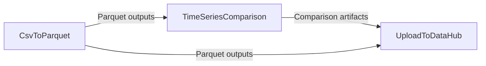

# Workflow: Convert PLEXOS CSV outputs, validate against a baseline, and publish results to DataHub

## Usecase
You run a PLEXOS simulation that produces many CSV outputs under `{output_path}` and you want to standardize them to Parquet for downstream analytics. You also need an automated quality check that compares key time series against a baseline dataset stored in DataHub, then publishes both the converted outputs and the comparison artifacts back to DataHub under a consistent results folder.

## Problem
Without automation, you end up manually converting large CSV folders, hand-picking files to compare, and uploading results one-by-one. This is slow and error-prone: it’s easy to compare the wrong files, miss a subfolder, or upload incomplete artifacts, which makes validation and audit trails difficult.

## Data Flow Diagram


## Scripts Involved

| Order | Script | Phase | Purpose | Key Arguments |
|---:|---|---|---|---|
| 1 | [CsvToParquet](../Post/PLEXOS/CsvToParquet/README.md) | Post | Convert all CSV outputs under a folder to Parquet in-place (validated before deleting CSV). | `--root-folder`, `--workers`, `--compression` |
| 2 | [TimeSeriesComparison](../Automation/PLEXOS/TimeSeriesComparison/README.md) | Automation | Compare 2–4 time-series datasets (local and/or DataHub), generate metrics and plots, and upload comparison artifacts to DataHub. | `--file`, `--output-path`, `--cli-path`, `--environment`, `--alignment` |
| 3 | [UploadToDataHub](../Automation/PLEXOS/UploadToDataHub/README.md) | Automation | Upload the converted Parquet outputs (and any other local artifacts) to a target DataHub folder. | `--cli-path`, `--environment`, `--directory`, `--pattern`, `--datahub-path`, `--versioned` |

## Complete Task Definition
```json
[
  {
    "Name": "Convert PLEXOS CSV outputs to Parquet",
    "TaskType": "Post",
    "Files": [
      {
        "Path": "Post/PLEXOS/CsvToParquet/convert_csv_to_parquet.py",
        "Version": null
      }
    ],
    "Arguments": "python3 convert_csv_to_parquet.py --root-folder output_path --workers 6 --compression zstd",
    "ContinueOnError": false,
    "ExecutionOrder": 1
  },
  {
    "Name": "Compare key time series against baseline",
    "TaskType": "Automation",
    "Files": [
      {
        "Path": "Automation/PLEXOS/TimeSeriesComparison/timeseries_comparison.py",
        "Version": null
      }
    ],
    "Arguments": "python3 timeseries_comparison.py --file \"{output_path}/TimeSeries/Prices.parquet\":local-filepath:Datetime:Price --file \"Project/Study/Baselines/PricesBaseline.parquet\":datahub-filepath:Datetime:Price --output-path \"Project/Study/Results:RunValidation\" --cli-path /path/to/cli --environment <your-environment> --alignment union --handle-missing none --keep-diff-unchanged",
    "ContinueOnError": false,
    "ExecutionOrder": 2
  },
  {
    "Name": "Upload converted Parquet outputs to DataHub",
    "TaskType": "Automation",
    "Files": [
      {
        "Path": "Automation/PLEXOS/UploadToDataHub/upload_to_datahub.py",
        "Version": null
      }
    ],
    "Arguments": "python3 upload_to_datahub.py --cli-path /path/to/cli --environment <your-environment> --directory \"{output_path}\" --pattern \"**/*.parquet\" --datahub-path \"Project/Study/Results/RunOutputs\" --versioned",
    "ContinueOnError": false,
    "ExecutionOrder": 3
  }
]
```

## Step-by-Step Walkthrough

### 1) CsvToParquet
This step scans the folder you specify and converts every `.csv` it finds (recursively) into a `.parquet` file in the same location. Each CSV is only deleted after a row-count validation confirms the Parquet conversion succeeded.

- **Reads from:** `{output_path}` (when you pass `--root-folder output_path`)
- **Writes to:** `{output_path}` (new `.parquet` files alongside the original CSV structure)
- **Environment variables needed:** `output_path` (required)
- **If it fails:** the task exits non-zero and the workflow stops. If a specific file fails validation, the source CSV is kept and the script continues, but the overall exit code is `1` if any file fails conversion.

### 2) TimeSeriesComparison
This step performs a QA comparison between 2–4 datasets. In this workflow, you compare a local Parquet produced in step 1 (under `{output_path}`) against a baseline file stored in DataHub. The script aligns timestamps, computes metrics (for example MAE/RMSE/correlation), generates plots, and uploads the comparison artifacts to the DataHub path you provide via `--output-path`.

- **Reads from:**
  - Local file(s) under `{output_path}` using `--file "...":local-filepath:...`
  - DataHub file(s) using `--file "Project/...":datahub-filepath:...`
- **Writes to:** DataHub under the `--output-path` location in a timestamped subfolder (for example `RunValidation_Comparison_20260212_143522/`)
- **Environment variables needed:** none (all authentication and environment selection are passed as arguments)
- **If it fails:** the task exits non-zero and the workflow stops. Common hard failures include fewer than 2 resolvable files, no datetime column detected, or no numeric value columns found.

### 3) UploadToDataHub
This step uploads the converted Parquet outputs from `{output_path}` to a target DataHub folder. Using `--directory` plus `--pattern "**/*.parquet"` ensures you capture all Parquet outputs across nested result folders.

- **Reads from:** `{output_path}` (local directory upload)
- **Writes to:** DataHub at `--datahub-path` (files keep their original filenames)
- **Environment variables needed:** none
- **If it fails:** the task exits non-zero. If no files match the pattern or authentication fails, nothing is uploaded and you must correct the inputs and rerun.

## Data Flow Between Steps

### Step 1 to Step 2
- **What step 1 produces:** Parquet files created in-place under `{output_path}`, preserving the original directory structure. For each `something.csv`, the script creates `something.parquet` in the same folder.
- **What step 2 consumes:** One or more local files referenced explicitly in `--file` arguments, such as `{output_path}/TimeSeries/Prices.parquet`. Step 2 does not automatically discover files; you must point it at the specific outputs you want to validate.

### Step 2 to Step 3
- **What step 2 produces:** Comparison artifacts uploaded directly to DataHub under the `--output-path` location in a timestamped folder (for example `comparison_summary.json`, `aligned_data.parquet`, and `comparison_*.png`).
- **What step 3 consumes:** This workflow uses step 3 to upload the converted Parquet outputs from `{output_path}`. Step 3 does not need the comparison artifacts because those are already uploaded by step 2.

## Troubleshooting

| Symptom | Cause | Fix |
|---|---|---|
| CsvToParquet exits with code 1 and logs mention `output_path` | `output_path` environment variable is not set in the execution context | Ensure the platform injects `output_path`, and pass `--root-folder output_path` exactly (not a literal filesystem path) |
| CsvToParquet leaves some CSV files behind | Row-count validation failed for those files or conversion failed for specific inputs | Review logs for the failing file; the CSV is intentionally retained to prevent data loss. Fix the problematic CSV and rerun conversion |
| TimeSeriesComparison exits with “Fewer than 2 files resolve successfully” | One or more `--file` entries point to a missing local file or an unreachable DataHub path | Verify the local path under `{output_path}` exists and the DataHub path is correct; ensure `--cli-path` and `--environment` are valid |
| TimeSeriesComparison exits with “No datetime column detected” | The dataset does not have a recognizable datetime column and none was specified | Update the `--file` configuration to include the timestamp column or components (for example `Datetime` or `year,month,day`) |
| UploadToDataHub exits with “No files specified” or uploads 0 files | `--directory` not provided, or `--pattern` does not match any files | Use `--directory "{output_path}"` and a pattern that matches your outputs (for example `--pattern "**/*.parquet"`) |
| UploadToDataHub authentication fails | Wrong `--environment`, invalid CLI path, or missing credentials for the CLI | Confirm `--cli-path` points to the PLEXOS Cloud CLI executable and `--environment` matches your tenant configuration; re-authenticate with the CLI if required |