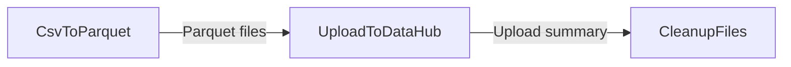

# Workflow: Post-Simulation Results Conversion, DataHub Upload, and CSV Cleanup

## Usecase
You run PLEXOS Cloud simulations that produce many CSV result files under `{output_path}`. You want to store results in DataHub in a compact, analytics-friendly format (Parquet), and you want to remove the bulky CSVs after you confirm the Parquet outputs exist.

This workflow converts all CSV outputs to Parquet in-place, uploads the Parquet results to a DataHub folder, then deletes the original CSV files to reduce storage and clutter.

## Problem
Without automation, engineers typically:
- Manually locate and convert many CSV files (often across nested folders), which is slow and easy to miss.
- Upload files inconsistently (wrong DataHub folder, partial uploads, or incorrect patterns).
- Leave large CSV outputs behind, increasing storage usage and making later post-processing harder.

This workflow standardizes the post-run handling so your results are consistently converted, published, and cleaned up.

## Data Flow Diagram


## Scripts Involved

| Order | Script | Phase | Purpose | Key Arguments |
|---:|---|---|---|---|
| 1 | [CsvToParquet](../Post/PLEXOS/CsvToParquet/README.md) | Post | Convert all CSV files under a folder to Parquet in-place (deletes CSV only after validation). | `--root-folder`, `--workers`, `--compression` |
| 2 | [UploadToDataHub](../Automation/PLEXOS/UploadToDataHub/README.md) | Automation | Upload a local directory (or files) to a DataHub path using the PLEXOS Cloud CLI and SDK. | `--cli-path`, `--environment`, `--directory`, `--pattern`, `--datahub-path`, `--versioned` |
| 3 | [CleanupFiles](../Post/PLEXOS/CleanupFiles/README.md) | Post | Delete remaining CSV files (or other matches) from a target path after upload. | `--path`, `--pattern`, `--recursive`, `--dry-run` |

## Complete Task Definition
```json
[
  {
    "Name": "Convert CSV outputs to Parquet",
    "TaskType": "Post",
    "Files": [
      { "Path": "Post/PLEXOS/CsvToParquet/convert_csv_to_parquet.py", "Version": null },
      { "Path": "requirements.txt", "Version": null }
    ],
    "Arguments": "python3 convert_csv_to_parquet.py --root-folder output_path --workers 6 --compression zstd",
    "ContinueOnError": false,
    "ExecutionOrder": 1
  },
  {
    "Name": "Upload Parquet results to DataHub",
    "TaskType": "Automation",
    "Files": [
      { "Path": "Automation/PLEXOS/UploadToDataHub/upload_to_datahub.py", "Version": null }
    ],
    "Arguments": "python3 upload_to_datahub.py --cli-path /path/to/cli --environment <your-environment> --directory output_path --pattern **/*.parquet --datahub-path Project/Study/Results --versioned",
    "ContinueOnError": false,
    "ExecutionOrder": 2
  },
  {
    "Name": "Cleanup source CSV files",
    "TaskType": "Post",
    "Files": [
      { "Path": "Post/PLEXOS/CleanupFiles/cleanup_files.py", "Version": null }
    ],
    "Arguments": "python3 cleanup_files.py --path output_path --pattern *.csv --recursive",
    "ContinueOnError": true,
    "ExecutionOrder": 3
  }
]
```

## Step-by-Step Walkthrough

### 1) Convert CSV outputs to Parquet ([CsvToParquet](../Post/PLEXOS/CsvToParquet/README.md))
This step scans the folder you specify and converts every `.csv` it finds (including subfolders) into a `.parquet` file in the same location. Each CSV is deleted only after a row-count validation confirms the Parquet conversion succeeded for that file.

- **Reads from:** `{output_path}` (because `--root-folder output_path` resolves the `output_path` environment variable)
- **Writes to:** `{output_path}` (new `.parquet` files alongside the original CSVs)
- **Deletes:** source `.csv` files only after validation per file
- **Environment variables needed:** `output_path`
- **If it fails:** the task exits non-zero; downstream steps should not run because Parquet outputs may be incomplete.

### 2) Upload Parquet results to DataHub ([UploadToDataHub](../Automation/PLEXOS/UploadToDataHub/README.md))
This step uploads the Parquet files from the local directory to the target DataHub folder. It authenticates to the specified cloud environment and uploads all files matching the glob pattern.

- **Reads from:** `{output_path}` (because `--directory output_path` points at the same results folder used in step 1)
- **Uploads to:** DataHub path `Project/Study/Results` (example)
- **Environment variables needed:** none
- **SDK behavior:** uses the PLEXOS Cloud SDK; see [CloudSDK](../Documentation/CloudSDK.md) for method details.
- **If it fails:** the task exits non-zero; cleanup should not remove CSVs unless you intentionally set `ContinueOnError` to allow cleanup regardless.

### 3) Cleanup remaining CSV files ([CleanupFiles](../Post/PLEXOS/CleanupFiles/README.md))
This step removes any remaining CSV files under the target path. It is typically last, and it is safe to run with `ContinueOnError: true` so the overall workflow can still complete even if there are no matches.

- **Reads from:** `{output_path}` (because `--path output_path` resolves the `output_path` environment variable)
- **Deletes:** files matching `--pattern *.csv` (recursively due to `--recursive`)
- **Environment variables needed:** `output_path`
- **If it fails:** the task exits non-zero (for example, permission issues or missing path). With `ContinueOnError: true`, the workflow can still be considered complete, but you should review logs to confirm what was deleted.

## Data Flow Between Steps
- **Step 1 → Step 2**
  - **Produced in `{output_path}`:** Parquet files created next to the original CSVs, preserving the directory structure under `{output_path}`.
  - **Expected by step 2:** files matching `**/*.parquet` under the directory passed via `--directory`.
  - **Naming convention:** each converted file keeps its base name, changing only the extension from `.csv` to `.parquet`.

- **Step 2 → Step 3**
  - **No file handoff required:** step 3 does not depend on upload artifacts; it operates on `{output_path}`.
  - **Deletion target:** any remaining `*.csv` files under `{output_path}` (including nested folders when `--recursive` is set).

## Troubleshooting

| Symptom | Cause | Fix |
|---|---|---|
| CsvToParquet exits with code 1 and logs mention `output_path` | `output_path` environment variable is not set, but `--root-folder output_path` was used | Ensure the platform injects `output_path` for Post tasks, or pass an explicit path to `--root-folder` instead of `output_path`. |
| CsvToParquet completes but some CSV files remain | Row-count validation failed for specific files, so the script kept the source CSV to prevent data loss | Review logs for the affected files, re-run conversion for those files, and only then run cleanup. |
| UploadToDataHub exits with code 1 and reports invalid CLI path | `--cli-path` does not point to the PLEXOS Cloud CLI executable | Set `--cli-path` to the correct executable location (example format: `/path/to/cli`). |
| UploadToDataHub exits with code 1 and reports authentication failure | Wrong `--environment` value or missing/invalid credentials for the CLI/SDK | Verify the environment name (`<your-environment>`) and confirm you can authenticate with the CLI outside the workflow. |
| UploadToDataHub exits with code 1 and reports no files uploaded | `--pattern` does not match any Parquet files under `--directory` | Confirm step 1 produced `.parquet` files under `{output_path}` and adjust `--pattern` (for example `**/*.parquet`). |
| CleanupFiles exits with code 1 and reports target path does not exist | `--path` points to a non-existent directory, or `output_path` is not set | Confirm `{output_path}` exists for the run and that you passed `--path output_path` only when `output_path` is available. |
| CleanupFiles deletes more than expected | `--pattern` is too broad (or defaulted to `**/*`) and `--recursive` was enabled | Use a restrictive pattern like `*.csv` and consider running once with `--dry-run` to preview deletions. |