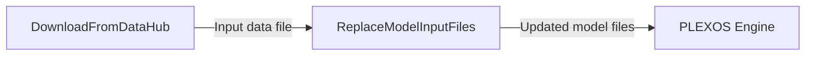

# Workflow: Update a PLEXOS model input by downloading a DataHub file and replacing the assigned timeseries

## Usecase
You need to refresh a PLEXOS input timeseries (for example, a gas price CSV) using the latest version stored in DataHub. Your study already contains a model database at `{simulation_path}` and you want the model to point to the newly downloaded file for a specific object and property assignment.

This workflow downloads the file into the study workspace and then updates the model so the target property assignment references that new file.

## Problem
Without automation, you typically download the file manually, copy it into the correct study folder, then open or edit the model to repoint the property assignment. This is slow to repeat across studies, easy to mis-path (absolute path vs study-relative path), and often results in mismatched `project.xml` vs database state if you forget to regenerate XML after changes.

## Data Flow Diagram


## Scripts Involved

| Order | Script | Phase | Purpose | Key Arguments |
|---:|---|---|---|---|
| 1 | [Download From Data Hub](../Automation/PLEXOS/DownloadFromDataHub/README.md) | Automation | Download one or more DataHub files to a local directory | `--cli-path`, `--environment`, `--file`, `--output-dir` |
| 2 | [ReplaceModelInputFiles](../Pre/PLEXOS/ReplaceModelInputFiles/README.md) | Pre | Replace a model property input assignment to point at the newly downloaded file and regenerate `project.xml` | `--parent-object-name`, `--child-object-name`, `--data-file-path`, `--parent-class-name`, `--collection-name`, `--property-name`, `--replace-existing` |

## Complete Task Definition
```json
[
  {
    "Name": "Download latest gas price CSV from DataHub",
    "TaskType": "Pre",
    "Files": [
      {
        "Path": "Automation/PLEXOS/DownloadFromDataHub/download_from_datahub.py",
        "Version": null
      }
    ],
    "Arguments": "python3 download_from_datahub.py --cli-path /path/to/cli/plexos-cloud --environment <your-environment> --file DataHub/Inputs/Fuels/gas_prices_ng_europe.csv --output-dir {simulation_path}",
    "ContinueOnError": false,
    "ExecutionOrder": 1
  },
  {
    "Name": "Replace Natural Gas Europe gas price input assignment",
    "TaskType": "Pre",
    "Files": [
      {
        "Path": "Pre/PLEXOS/ReplaceModelInputFiles/replace_model_input_files.py",
        "Version": null
      }
    ],
    "Arguments": "python3 replace_model_input_files.py --parent-class-name System --collection-name Fuels --property-name Price --parent-object-name System --child-object-name Natural%20Gas%20Europe --data-file-path gas_prices_ng_europe.csv --band-id 1 --value none --replace-existing true",
    "ContinueOnError": false,
    "ExecutionOrder": 2
  }
]
```

## Step-by-Step Walkthrough

### 1) Download From Data Hub
Script: [Download From Data Hub](../Automation/PLEXOS/DownloadFromDataHub/README.md)

You download the required DataHub file into the study workspace so the next step can validate it exists under `{simulation_path}`. The file is saved with its original filename in the directory you pass via `--output-dir`.

- Inputs:
  - DataHub path(s) provided via `--file`
  - CLI executable path via `--cli-path`
  - Cloud environment name via `--environment`
- Writes:
  - The downloaded file(s) into `{simulation_path}` (because `--output-dir {simulation_path}`)
- Environment variables:
  - None
- Failure behavior:
  - Exits with code `1` if authentication fails, the DataHub path is wrong, or all downloads fail. With `ContinueOnError: false`, the workflow stops and the model is not modified.

### 2) ReplaceModelInputFiles
Script: [ReplaceModelInputFiles](../Pre/PLEXOS/ReplaceModelInputFiles/README.md)

You update a specific property assignment so it points to the newly downloaded file using a study-relative path (`--data-file-path`). The script validates the file exists at `{simulation_path}/{data-file-path}`, updates the model database, and then regenerates `project.xml` from the updated database.

- Inputs:
  - The downloaded data file at `{simulation_path}/gas_prices_ng_europe.csv`
  - The model database resolved from `--model-path`, then `{simulation_path}/reference.db`, then `sqlite_input_path`
  - Target membership and property selection via:
    - `--parent-object-name` and `--child-object-name`
    - Either name-based lookup (`--parent-class-name`, `--collection-name`, `--property-name`) or explicit IDs (`--parent-class-lang-id`, `--collection-lang-id`, `--property-lang-id`)
- Writes:
  - Updates the resolved SQLite model database
  - Regenerates `{simulation_path}/project.xml` (backs up existing XML and regenerates)
- Environment variables:
  - Required: `cloud_cli_path`, `study_id`
  - Optional: `simulation_path` (default `/simulation`), `sqlite_input_path`
- Failure behavior:
  - Exits with code `1` if the model path cannot be resolved, the data file is missing, the membership/property cannot be found, or DB-to-XML conversion fails. With `ContinueOnError: false`, the workflow stops before the engine runs.

Reference for SDK usage and parameter conventions: [CloudSDK](../Documentation/CloudSDK.md)

## Data Flow Between Steps

- Step 1 → Step 2:
  - Step 1 writes the downloaded file into `{simulation_path}` using the original filename from DataHub.
  - Step 2 expects `--data-file-path` to be a relative path from `{simulation_path}` (for example `gas_prices_ng_europe.csv`), and it validates the file exists at `{simulation_path}/gas_prices_ng_europe.csv`.
  - Naming convention: the local filename is preserved from the DataHub resource name; keep `--data-file-path` aligned to that filename (or to a subfolder path if you download into a subfolder under `{simulation_path}`).

- Step 2 → PLEXOS Engine:
  - Step 2 updates the model database and regenerates `{simulation_path}/project.xml`, which is what the engine uses for the study configuration.

## Troubleshooting

| Symptom | Cause | Fix |
|---|---|---|
| Download step fails with exit code 1 | `--cli-path` is wrong or not executable | Point `--cli-path` to the correct PLEXOS Cloud CLI executable path and ensure it is runnable in the task environment |
| Download step reports file not found | Incorrect `--file` DataHub path or missing permissions | Verify the DataHub path string and confirm your account has access in the specified `--environment` |
| Replace step fails saying the data file is not found at `{simulation_path}` | You downloaded to a different directory than `{simulation_path}`, or `--data-file-path` is not relative | Set `--output-dir {simulation_path}` in step 1 and set `--data-file-path` to the filename only (or a relative subpath under `{simulation_path}`) |
| Replace step fails due to missing `study_id` | `study_id` environment variable is required for DB-to-XML conversion | Ensure `study_id` is set in the simulation environment before running the Pre task |
| Replace step cannot resolve the model path | No `--model-path`, and `{simulation_path}/reference.db` does not exist, and `sqlite_input_path` is not set | Provide `--model-path` or ensure `{simulation_path}/reference.db` exists, or set `sqlite_input_path` |
| Replace step cannot find membership or property | Wrong object names, or wrong class/collection/property names or IDs | Confirm `--parent-object-name` and `--child-object-name` match the model, and use either correct name-based arguments or correct `--*-lang-id` values (IDs take priority if both are provided) |