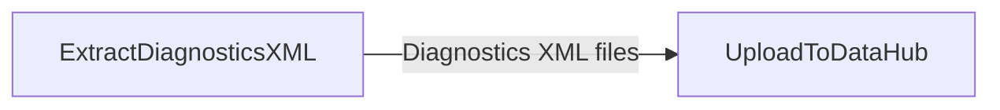

# Workflow: Preserve PLEXOS Diagnostics and Publish Post-Simulation Outputs to DataHub

## Usecase
You run PLEXOS Cloud simulations and need to retain diagnostics XML for audit and troubleshooting, while also publishing selected solution outputs for downstream analysis. This workflow uploads diagnostics XML from `{simulation_path}` to a structured DataHub location, then uploads a broader set of post-simulation files (for example, reports or exported results) from a local directory to DataHub.

This is commonly used when multiple teams need consistent access to run artifacts in DataHub under predictable paths.

## Problem
Without automation, diagnostics XML is easy to lose because it lives inside the simulation file structure and is often overwritten or hard to locate after the run. Manually uploading files is slow and inconsistent: paths vary by user, uploads are missed, and it becomes difficult to correlate diagnostics with a specific `execution_id` and `simulation_id`.

You also risk uploading the wrong subset of results (or none at all) when selecting files by hand.

## Data Flow Diagram


## Scripts Involved

| Order | Script | Phase | Purpose | Key Arguments |
|---:|---|---|---|---|
| 1 | [ExtractDiagnosticsXML](../Post/PLEXOS/ExtractDiagnosticsXML/README.md) | Post | Upload PLEXOS diagnostics XML from `{simulation_path}` to a structured DataHub folder | `--remote-path`, `--pattern`, `--versioned` |
| 2 | [UploadToDataHub](../Automation/PLEXOS/UploadToDataHub/README.md) | Automation | Upload one or more local files or an entire directory to a DataHub path | `--cli-path`, `--environment`, `--directory`, `--pattern`, `--datahub-path`, `--versioned` |

## Complete Task Definition
```json
[
  {
    "Name": "Upload diagnostics XML to DataHub",
    "TaskType": "Post",
    "Files": [
      {
        "Path": "Post/PLEXOS/ExtractDiagnosticsXML/extract_diag_xml.py",
        "Version": null
      }
    ],
    "Arguments": "python3 extract_diag_xml.py --remote-path Project/Study/diagnostics --pattern \"**/*Diagnostics.xml\" --versioned false",
    "ContinueOnError": true,
    "ExecutionOrder": 1
  },
  {
    "Name": "Upload solution files to DataHub",
    "TaskType": "Post",
    "Files": [
      {
        "Path": "Automation/PLEXOS/UploadToDataHub/upload_to_datahub.py",
        "Version": null
      }
    ],
    "Arguments": "python3 upload_to_datahub.py --cli-path /path/to/cli --environment <your-environment> --directory {output_path} --pattern \"**/*\" --datahub-path Project/Study/Results --versioned",
    "ContinueOnError": true,
    "ExecutionOrder": 2
  }
]
```

## Step-by-Step Walkthrough

### 1) ExtractDiagnosticsXML
This step searches `{simulation_path}` for diagnostics XML files matching `--pattern` and uploads them to DataHub under the base `--remote-path`. The script appends the model name (read from the directory mapping), plus `execution_id` and `simulation_id`, so each run’s diagnostics land in a unique, traceable location.

**Reads**
- Diagnostics XML files under `{simulation_path}` matching `--pattern`
- Directory mapping JSON from `directory_map_path` if set, otherwise from `{simulation_path}/splits/directorymapping.json`

**Writes**
- No files are written to `{output_path}`; this step uploads directly to DataHub.

**Environment variables required**
- `cloud_cli_path` (required)
- `simulation_path` (optional; default `/simulation`)
- `simulation_id` (optional; default empty, but required by the script at runtime)
- `execution_id` (optional; default empty, but required by the script at runtime)
- `directory_map_path` (optional; default empty)

**Failure behavior**
- Exits with code `1` if `cloud_cli_path` is missing, if `simulation_id` or `execution_id` are missing, if the directory mapping cannot be found/read, or if one or more uploads fail.
- Exits with code `0` if no files match the pattern (it warns but treats this as non-fatal).

**SDK reference**
- Uses `CloudSDK` and `datahub.upload`. See [CloudSDK](../Documentation/CloudSDK.md).

### 2) UploadToDataHub
This step uploads a set of files to DataHub from either explicit `--file` arguments or a directory specified by `--directory` (optionally filtered by `--pattern`). In this workflow, it is configured to upload everything under `{output_path}` to a results folder in DataHub.

**Reads**
- Local files from `--directory` (here: `{output_path}`) matching `--pattern`

**Writes**
- No files are written to `{output_path}`; this step uploads directly to DataHub.

**Environment variables required**
- None.

**Failure behavior**
- Exits with code `1` if authentication fails, the CLI path is invalid, the directory does not exist, no files are specified, or uploads fail.
- Exits with code `0` when uploads succeed.

**SDK reference**
- Uses `CloudSDK`, `environment.set_user_environment`, `auth.login`, and `datahub.upload`. See [CloudSDK](../Documentation/CloudSDK.md).

## Data Flow Between Steps
There is no required file handoff through `{output_path}` between these two steps:

- **Step 1** uploads diagnostics XML directly from `{simulation_path}` to DataHub. File selection is controlled by `--pattern` (default `**/*Diagnostics.xml`).
- **Step 2** uploads files directly from `{output_path}` to DataHub. File selection is controlled by `--pattern` (default `**/*`).

Recommended conventions to keep uploads predictable:
- Keep diagnostics uploads separated from general results by using distinct DataHub base paths (for example, `Project/Study/diagnostics` vs `Project/Study/Results`).
- If `{output_path}` contains large intermediate artifacts, narrow Step 2 using `--pattern` (for example, only CSV exports) to reduce upload time and storage.

## Troubleshooting

| Symptom | Cause | Fix |
|---|---|---|
| ExtractDiagnosticsXML fails with missing CLI path | `cloud_cli_path` is not set in the run environment | Ensure the platform provides `cloud_cli_path` and it points to the PLEXOS Cloud CLI executable |
| ExtractDiagnosticsXML fails complaining about missing IDs | `simulation_id` or `execution_id` is empty | Verify the task is running in a PLEXOS Cloud post-task context where these are injected |
| ExtractDiagnosticsXML fails due to mapping not found | `directory_map_path` is unset and `{simulation_path}/splits/directorymapping.json` is missing | Provide a valid `directory_map_path` or ensure the mapping file exists in the expected location |
| ExtractDiagnosticsXML uploads nothing but exits 0 | `--pattern` does not match your diagnostics filenames | Adjust `--pattern` (for example, `**/*ST*Diagnostics.xml`) and confirm diagnostics were generated |
| UploadToDataHub exits 1 with authentication failure | Wrong `--environment` or missing/invalid credentials for the CLI | Confirm `--environment` is correct and that the CLI is authenticated for your account in that environment |
| UploadToDataHub exits 1 with invalid CLI path | `--cli-path` does not point to the executable | Set `--cli-path` to the correct location of the PLEXOS Cloud CLI |
| UploadToDataHub exits 1 with directory not found | `{output_path}` is not present or not mounted for the task | Confirm the task has access to `{output_path}` and that prior steps produced outputs there |
| UploadToDataHub uploads too much data | `--pattern` is too broad (default `**/*`) | Narrow `--pattern` to the file types you actually need to publish (for example, `**/*.csv`) |