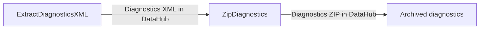

# Workflow: Archive PLEXOS Diagnostics XML and Store a Single ZIP in DataHub

## Usecase
You run PLEXOS simulations in the cloud and need to retain diagnostics XML for audit and troubleshooting, but you do not want hundreds or thousands of small XML files scattered across DataHub. This workflow uploads the diagnostics XML produced under {simulation_path}, then consolidates them into a single ZIP archive stored back in DataHub.

## Problem
Without automation, you typically:
- Manually locate diagnostics XML across simulation folders (often split/distributed runs).
- Upload many small files to DataHub, which is slow and easy to misplace.
- Later download and compress them by hand when you need to share or archive diagnostics.

That manual process is error-prone (wrong run, missing phase, incomplete set) and wastes time when you need diagnostics quickly.

## Data Flow Diagram


## Scripts Involved

| Order | Script | Phase | Purpose | Key Arguments |
|---:|---|---|---|---|
| 1 | [ExtractDiagnosticsXML](../Post/PLEXOS/ExtractDiagnosticsXML/README.md) | Post | Upload diagnostics XML from {simulation_path} to a structured DataHub folder | `--remote-path`, `--pattern`, `--versioned` |
| 2 | [ZipDiagnostics](../Post/PLEXOS/ZipDiagnostics/README.md) | Post | Download diagnostics XML from DataHub, zip them in {output_path}, and upload the ZIP back to DataHub | `--remote-base-path`, `--pattern`, `--keep-files` |

## Complete Task Definition
```json
[
  {
    "Name": "Upload diagnostics XML to DataHub",
    "TaskType": "Post",
    "Files": [
      {
        "Path": "Post/PLEXOS/ExtractDiagnosticsXML/extract_diag_xml.py",
        "Version": null
      }
    ],
    "Arguments": "python3 extract_diag_xml.py --remote-path GridOps/Planning/Studies/Diagnostics --pattern \"**/*Diagnostics.xml\" --versioned false",
    "ContinueOnError": false,
    "ExecutionOrder": 1
  },
  {
    "Name": "Archive diagnostics as ZIP",
    "TaskType": "Post",
    "Files": [
      {
        "Path": "Post/PLEXOS/ZipDiagnostics/zip_downloaded_xmls.py",
        "Version": null
      }
    ],
    "Arguments": "python3 zip_downloaded_xmls.py --remote-base-path GridOps/Planning/Studies/Diagnostics --pattern \"**/*Diagnostics.xml\" --keep-files false",
    "ContinueOnError": true,
    "ExecutionOrder": 2
  }
]
```

## Step-by-Step Walkthrough

### 1) ExtractDiagnosticsXML
**Script:** [ExtractDiagnosticsXML](../Post/PLEXOS/ExtractDiagnosticsXML/README.md)

**What it does**
- Searches for PLEXOS diagnostics XML files under {simulation_path} using `--pattern`.
- Reads the model name from the directory mapping JSON (from `directory_map_path` or the fallback mapping location described in the script README).
- Uploads matching XML files to DataHub under a structured path based on:
  - your `--remote-path` base
  - model name
  - `execution_id`
  - `simulation_id`

**Inputs**
- Local files: diagnostics XML under {simulation_path} matching `--pattern`.

**Outputs**
- DataHub files: diagnostics XML uploaded to the remote folder structure created by the script.
- This step does not write working files to {output_path}; it uploads directly from {simulation_path}.

**Environment variables used**
- Required: `cloud_cli_path`
- Optional (platform-provided in typical runs): `simulation_path`, `simulation_id`, `execution_id`, `directory_map_path`

**Failure behavior**
- Fails (exit code `1`) if `cloud_cli_path` is missing, or if `simulation_id` / `execution_id` are missing.
- Succeeds (exit code `0`) with a warning if no files match the pattern (no upload occurs).

---

### 2) ZipDiagnostics
**Script:** [ZipDiagnostics](../Post/PLEXOS/ZipDiagnostics/README.md)

**What it does**
- Constructs the expected remote diagnostics folder using:
  - `--remote-base-path`
  - model name from the directory mapping JSON
  - `execution_id`
  - `simulation_id`
- Downloads diagnostics XML from DataHub matching `--pattern` into {output_path}.
- Creates a ZIP archive named `{model_name}_diagnostics.zip` in {output_path}.
- Uploads the ZIP back to DataHub.
- By default (`--keep-files false`), removes the downloaded XML files after the ZIP is created and uploaded, leaving only the ZIP as the main artifact in {output_path}.

**Inputs**
- DataHub files: diagnostics XML previously uploaded by step 1.

**Outputs**
- Local files in {output_path}:
  - `{model_name}_diagnostics.zip`
  - Downloaded XML files (only retained if `--keep-files` is enabled)
- DataHub files:
  - Uploaded ZIP archive at the constructed remote path.

**Environment variables used**
- Required: `cloud_cli_path`, `execution_id`, `simulation_id`
- Optional: `directory_map_path`, `output_path`

**Failure behavior**
- Fails (exit code `1`) if required environment variables are missing.
- Fails (exit code `1`) if no files match the pattern in DataHub (this is different from step 1, which can succeed with no matches).
- If some downloads fail but others succeed, it can still zip the successfully downloaded files and proceed (partial success), then fails only if the overall workflow cannot complete.

## Data Flow Between Steps

**Step 1 to Step 2 (via DataHub, not via {output_path})**
- Step 1 uploads multiple files matching:
  - `**/*Diagnostics.xml` by default, or your custom `--pattern` (for example `**/*ST*Diagnostics.xml`).
- Step 2 expects those same diagnostics XML files to exist in DataHub under the remote path structure it constructs from:
  - `--remote-base-path` (or `--remote-path` base you used in step 1)
  - model name from directory mapping JSON
  - `execution_id`
  - `simulation_id`

**Files created under {output_path} by Step 2**
- ZIP file naming convention:
  - `{model_name}_diagnostics.zip`
- Temporary download layout:
  - XML files are downloaded into {output_path} (and may include subfolders depending on how the DataHub download returns paths).
  - If `--keep-files false`, the XML files are removed after the ZIP is uploaded, leaving the ZIP as the primary artifact.

## Troubleshooting

| Symptom | Cause | Fix |
|---|---|---|
| ExtractDiagnosticsXML fails immediately with an error about `cloud_cli_path` | `cloud_cli_path` is required but not set in the run environment | Ensure the platform/runtime sets `cloud_cli_path` to the Cloud CLI executable path (for example `/path/to/cli`) |
| ExtractDiagnosticsXML fails complaining about missing `simulation_id` or `execution_id` | The platform did not inject these variables, or they were cleared/overridden | Verify the task is running in a PLEXOS Cloud post context where `simulation_id` and `execution_id` are provided |
| ExtractDiagnosticsXML reports no matching files but exits successfully | The `--pattern` does not match the diagnostics filenames produced by your run | Adjust `--pattern` (for example `**/*ST*Diagnostics.xml`) and confirm diagnostics exist under {simulation_path} |
| ZipDiagnostics fails with “no files matched” | Step 1 uploaded nothing, or `--remote-base-path` / `--pattern` does not point to the uploaded diagnostics | Use the same base path intent across both steps and keep patterns consistent; confirm diagnostics exist in DataHub for the given `execution_id` and `simulation_id` |
| ZipDiagnostics fails due to missing directory mapping | `directory_map_path` not set and the fallback mapping file is not present | Set `directory_map_path` to the correct mapping JSON location for your run type, or ensure the fallback mapping file exists as described in the script README |
| ZipDiagnostics uploads nothing or fails on upload | DataHub permissions or remote path is invalid | Confirm the DataHub destination path is allowed for your token/role and that the base path is correct; see [CloudSDK](../Documentation/CloudSDK.md) for DataHub operation context |