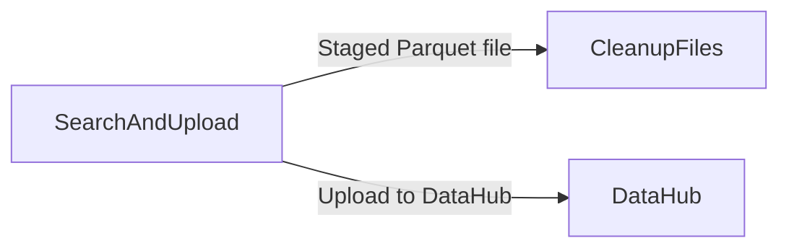

# Workflow: Post simulation results upload with CSV to Parquet conversion and cleanup

## Usecase
You run a PLEXOS simulation that produces one or more results files (often CSV) either under {simulation_path}, already staged in {output_path}, or packaged inside ZIP archives. You want to reliably locate the right file by name or glob pattern, convert CSV outputs to Parquet for downstream analytics, upload the staged artifact to a DataHub folder, and then remove staged files to keep {output_path} clean for the next run.

## Problem
Without automation, engineers typically hunt through nested folders (and sometimes ZIPs) to find the correct output, manually copy it out of read-only mounts, run ad-hoc conversions, and then upload to DataHub. This is slow and error-prone: you can upload the wrong file, miss results hidden in ZIPs, or leave large staged artifacts behind that accumulate across runs and consume storage.

## Data Flow Diagram


## Scripts Involved

| Order | Script | Phase | Purpose | Key Arguments |
|---:|---|---|---|---|
| 1 | [SearchAndUpload](../Post/PLEXOS/SearchAndUpload/README.md) | Post | Find a file by name or glob, stage it into {output_path}, convert CSV to Parquet, and optionally upload to DataHub | `--file-name`, `--path`, `--upload-path` |
| 2 | [CleanupFiles](../Post/PLEXOS/CleanupFiles/README.md) | Post | Delete staged files or folders from a target path using glob patterns (typically {output_path}) | `--path`, `--pattern`, `--recursive`, `--dry-run` |

## Complete Task Definition
```json
[
  {
    "Name": "Search, convert, and upload results file",
    "TaskType": "Post",
    "Files": [
      {
        "Path": "Post/PLEXOS/SearchAndUpload/search_and_upload.py",
        "Version": null
      },
      {
        "Path": "requirements.txt",
        "Version": null
      }
    ],
    "Arguments": "python3 search_and_upload.py --file-name 'report_*.csv' --path '{simulation_path}' --upload-path 'Project/Study/Results'",
    "ContinueOnError": false,
    "ExecutionOrder": 1
  },
  {
    "Name": "Cleanup staged Parquet files after upload",
    "TaskType": "Post",
    "Files": [
      {
        "Path": "Post/PLEXOS/CleanupFiles/cleanup_files.py",
        "Version": null
      }
    ],
    "Arguments": "python3 cleanup_files.py --path output_path --pattern '*.parquet' --recursive",
    "ContinueOnError": true,
    "ExecutionOrder": 2
  }
]
```

## Step-by-Step Walkthrough

### 1) SearchAndUpload
**What it does**
- Searches for `--file-name` (supports glob patterns) in the provided `--path`.
- If not found (or if `--path` is omitted), it falls back to searching {output_path} first, then {simulation_path}.
- Also searches inside any ZIP archives found in the search paths.
- Stages the first match into {output_path}. If the source is under {simulation_path}, it copies (because {simulation_path} is read-only). Otherwise it moves.
- If the staged file is a CSV, it converts it to Parquet (ZSTD) and validates row counts before deleting the source CSV.
- If `--upload-path` is provided, it uploads the staged file to that DataHub folder.

**Inputs**
- A file matching `--file-name` located somewhere under `--path}, {output_path}, or {simulation_path}, or inside ZIP archives in those locations.

**Outputs written for later steps**
- A staged file in {output_path}. If the input was CSV, the staged artifact becomes a `.parquet` file with the same stem as the CSV.

**Environment variables needed**
- `output_path` (required)
- `simulation_path` (required)
- `cloud_cli_path` (required when `--upload-path` is used)

**Failure behavior**
- Exits with code `1` if the file cannot be found, staged, converted, or uploaded. With `ContinueOnError: false`, the workflow stops and cleanup will not run.

**SDK/CLI notes**
- Upload uses the Cloud SDK and CLI integration; see [CloudSDK](../Documentation/CloudSDK.md) for platform context.

### 2) CleanupFiles
**What it does**
- Deletes files or folders matching `--pattern` from the directory specified by `--path`.
- When `--path output_path` is used, it resolves the target directory from the `output_path` environment variable.
- With `--recursive`, it searches subdirectories as well.
- With `--dry-run`, it prints what would be deleted without deleting.

**Inputs**
- The staged artifacts in {output_path} created by the previous step.

**Outputs written for later steps**
- None. This is typically the final step.

**Environment variables needed**
- `output_path` (required when `--path output_path` is used)

**Failure behavior**
- If the target path does not exist or deletion fails due to permissions, it exits with code `1`. In this workflow it is configured with `ContinueOnError: true` so the overall run can still complete even if cleanup is not possible.

## Data Flow Between Steps

**From Step 1 to Step 2**
- Step 1 writes the staged artifact into {output_path}.
  - If the discovered file is `*.csv`, the script converts it and produces a `*.parquet` file with the same base name (CSV may be deleted after successful conversion).
  - If the discovered file is already `*.parquet`, it is staged as-is.
- Step 2 reads from {output_path} and deletes matches based on `--pattern`.
  - In the example task definition, it deletes `*.parquet` recursively under {output_path}.

**Naming and structure**
- The staged file name is preserved (or derived by changing `.csv` to `.parquet`).
- If the file is extracted from a ZIP, the extracted entry is flattened into {output_path} (subdirectory components inside the ZIP are not preserved).

## Troubleshooting

| Symptom | Cause | Fix |
|---|---|---|
| SearchAndUpload exits with code 1 and reports file not found | `--file-name` does not match the actual output name, or `--path` points to the wrong root | Confirm the exact filename or use a glob pattern (for example `report_*.csv`). If outputs are in ZIPs, ensure the ZIP is located under the searched path. |
| SearchAndUpload exits with code 1 when `--upload-path` is set | `cloud_cli_path` is not set in the execution environment | Ensure `cloud_cli_path` is available to the task runtime when using `--upload-path`. |
| SearchAndUpload fails during CSV conversion | CSV is malformed or conversion validation fails | Inspect the CSV output for formatting issues. Re-run with a known-good CSV; conversion only deletes the source CSV after successful validation. |
| CleanupFiles exits with code 1 | `--path` points to a directory that does not exist, or permissions prevent deletion | Use `--path output_path` only when `output_path` is set. If permissions are restricted, keep `ContinueOnError: true` and adjust what you delete (narrow `--pattern`). |
| CleanupFiles deletes more than expected | `--pattern` is too broad, especially with `--recursive` | Use a tighter pattern (for example `--pattern '*.parquet'`) and validate with `--dry-run` before enabling deletion. |