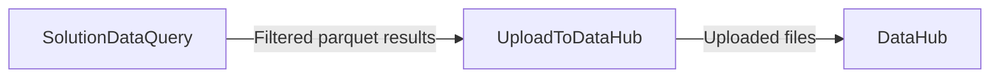

# Workflow: Stage filtered PLEXOS solution data and upload it to DataHub

## Usecase
You ran a PLEXOS Cloud simulation that produced large Parquet-based solution outputs, and you need a smaller, filtered dataset for downstream analysis and sharing. You want to extract only specific `CollectionName` and `PropertyName` slices (optionally filtered by object, category, and date range), write a single Parquet result into `{output_path}`, and then upload that result to a specific DataHub folder.

This workflow is designed for cases where solution tables are too large to manually download and filter, and where you need results delivered to a known DataHub path immediately after the run.

## Problem
Without automation, you typically have to locate the model Parquet output folder, manually join multiple Parquet tables (key info, period, and data partitions), apply filters consistently, and export a clean dataset. That manual process is slow, error-prone (especially with wildcard filters and date boundaries), and hard to reproduce across many runs.

Even if the platform automatically uploads artifacts from `{output_path}` at the end of a simulation, you still may need to push results to a specific DataHub location with controlled naming/versioning for consumption by other teams or pipelines.

## Data Flow Diagram


## Scripts Involved

| Order | Script | Phase | Purpose | Key Arguments |
|---:|---|---|---|---|
| 1 | [SolutionDataQuery](../Post/PLEXOS/SolutionDataQuery/README.md) | Post | Build a filtered joined solution dataset from model Parquet outputs and stage it into `{output_path}` | `--collection-name`, `--property-name`, `--object-name`, `--category-name`, `--start-date`, `--end-date`, `--parquet-name` |
| 2 | [UploadToDataHub](../Automation/PLEXOS/UploadToDataHub/README.md) | Automation | Upload the staged output file or directory to a target DataHub path | `--cli-path`, `--environment`, `--directory`, `--pattern`, `--datahub-path`, `--versioned`, `--file` |

## Complete Task Definition
```json
[
  {
    "Name": "Build filtered solution parquet",
    "TaskType": "Post",
    "Files": [
      {
        "Path": "Post/PLEXOS/SolutionDataQuery/solution_data_query.py",
        "Version": null
      }
    ],
    "Arguments": "python3 solution_data_query.py --collection-name Gas%20Zones --property-name Price --start-date 2024-01-01 --end-date 2024-12-31 --parquet-name gas_zone_price_2024",
    "ContinueOnError": false,
    "ExecutionOrder": 1
  },
  {
    "Name": "Upload solution data to DataHub",
    "TaskType": "Automation",
    "Files": [
      {
        "Path": "Automation/PLEXOS/UploadToDataHub/upload_to_datahub.py",
        "Version": null
      }
    ],
    "Arguments": "python3 upload_to_datahub.py --cli-path /path/to/cli/plexos-cloud --environment <your-environment> --directory {output_path} --pattern \"*_filtered_sols_data_*/gas_zone_price_2024.parquet\" --datahub-path Project/Study/Results/SolutionExtracts --versioned",
    "ContinueOnError": false,
    "ExecutionOrder": 2
  }
]
```

## Step-by-Step Walkthrough

### 1) SolutionDataQuery
**What it does**
- Reads the directory mapping JSON from `directory_map_path` to find the first model entry with a `ParquetPath`.
- Uses DuckDB to join solution Parquet datasets (key info, period, and data partitions).
- Applies your filters and writes a single compressed Parquet file into `{output_path}`.

**What it reads**
- `directory_map_path` (required) to locate the model Parquet output folder.
- Parquet structure under the resolved model `ParquetPath`, including:
  - `fullkeyinfo/FullKeyInfo.parquet`
  - `period/Period.parquet`
  - `data/dataFileId=*/*.parquet`

**What it writes to `{output_path}`**
- A timestamped staging folder and a Parquet file inside it:
  - `{output_path}/{MODEL_NAME}_filtered_sols_data_{YYYYMMDD_HHMMSS}/gas_zone_price_2024.parquet` when `--parquet-name gas_zone_price_2024` is provided.

**Environment variables required**
- `output_path`
- `directory_map_path`

**If it fails**
- Missing required env vars or missing/invalid mapping/parquet structure causes a non-zero exit.
- If filters produce zero rows, it exits non-zero (treat this as a data/filters issue, not an upload issue). The upload step should not run if this step fails.

---

### 2) UploadToDataHub
**What it does**
- Authenticates to the specified cloud environment and uploads either:
  - specific files provided via `--file` (repeatable), or
  - all files in a directory via `--directory` with an optional `--pattern`.

**What it reads**
- Local filesystem paths on the machine running the task:
  - In this workflow, it reads from `{output_path}` created by the prior step.

**What it writes**
- Uploads files to DataHub at `--datahub-path` using the original filenames.

**Environment variables required**
- None.

**If it fails**
- Invalid `--cli-path`, authentication issues with `--environment`, missing local files, or permission issues on the target DataHub path will cause a non-zero exit.
- If the `--pattern` does not match any files, the script reports no uploads and exits non-zero (treat as a staging or pattern issue).

For SDK behavior and parameter conventions used by this script, see [CloudSDK](../Documentation/CloudSDK.md).

## Data Flow Between Steps

### From SolutionDataQuery to UploadToDataHub
**Files produced by Step 1**
- Step 1 creates a new timestamped folder under `{output_path}`:
  - Folder pattern: `{MODEL_NAME}_filtered_sols_data_{YYYYMMDD_HHMMSS}`
- Inside that folder, it writes exactly one Parquet file:
  - If `--parquet-name` is provided: `{parquet_name}.parquet`
  - Otherwise: `parquetSolsData_{slug}.parquet` (auto-generated from filters)

**Files consumed by Step 2**
- Step 2 should target `{output_path}` via `--directory {output_path}` and select the intended file(s) via `--pattern`.
- Recommended pattern approach:
  - Match the timestamped folder plus the known output filename, for example:
    - `*_filtered_sols_data_*/gas_zone_price_2024.parquet`

## Troubleshooting

| Symptom | Cause | Fix |
|---|---|---|
| SolutionDataQuery exits non-zero immediately | `output_path` or `directory_map_path` is not set in the execution environment | Ensure the platform injects `output_path` and provide a valid `directory_map_path` for the run context |
| SolutionDataQuery exits non-zero with mapping-related errors | The mapping JSON is missing, invalid JSON, empty, or has no entry with `ParquetPath` | Validate the file at `directory_map_path` contains a list of model entries and at least one includes `Name`, `Id`, and `ParquetPath` |
| SolutionDataQuery exits non-zero with “expected parquet structure missing” | The resolved `ParquetPath` does not contain `fullkeyinfo`, `period`, and `data` subfolders | Confirm the simulation produced Parquet outputs and the mapping points to the correct model output directory |
| SolutionDataQuery produces zero rows and exits non-zero | Filters are too restrictive (collection/property/object/category/date) or do not match case-insensitively as expected | Start with only `--collection-name` and `--property-name`, then add optional filters; verify wildcard usage (`*` and `?`) and date range boundaries |
| UploadToDataHub exits non-zero with “Invalid CLI path” | `--cli-path` does not point to the PLEXOS Cloud CLI executable | Provide the correct full path to the CLI (for example `/path/to/cli/plexos-cloud`) |
| UploadToDataHub exits non-zero due to authentication | Wrong `--environment` value or missing/invalid credentials for the CLI | Verify the environment name and that the CLI is authenticated for the machine/user running the task |
| UploadToDataHub uploads nothing and exits non-zero | `--pattern` does not match the staged file path under `{output_path}` | Check the actual folder and filename created by Step 1 and adjust `--pattern` to match the timestamped folder and parquet filename |
| UploadToDataHub fails with permission or path errors | Target `--datahub-path` is invalid or you lack write access | Confirm the DataHub path exists (or is allowed to be created) and that your account has upload permissions to that location |