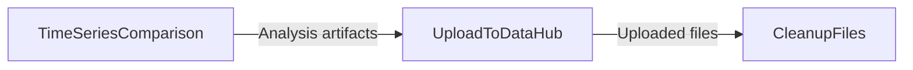

# Workflow: Compare time series outputs against a baseline, publish the analysis to DataHub, and clean up run artifacts

## Usecase
You run a PLEXOS study and need to validate key output time series (for example demand, price, generation) against a baseline dataset stored in DataHub or on disk. You want the comparison artifacts (summary metrics, aligned datasets, plots) published back to a DataHub results folder for review and audit. After publishing, you want to remove the timestamped analysis folders from `{output_path}` to keep the run workspace small and avoid accumulating stale artifacts.

## Problem
Without automation, you typically download or locate multiple result files, manually align timestamps, calculate metrics, generate plots, and then upload a bundle of outputs to DataHub. This is slow and error-prone: small differences in timestamp parsing, missing-value handling, or file selection can change conclusions, and manual uploads often miss files or overwrite the wrong location. Cleanup is also commonly skipped, which increases storage usage and makes later troubleshooting harder because `{output_path}` becomes cluttered.

## Data Flow Diagram


## Scripts Involved

| Order | Script | Phase | Purpose | Key Arguments |
|---:|---|---|---|---|
| 1 | [TimeSeriesComparison](../Automation/PLEXOS/TimeSeriesComparison/README.md) | Automation | Compare 2–4 time series datasets, compute metrics, generate plots, and upload results to a DataHub path. | `--file`, `--output-path`, `--cli-path`, `--environment`, `--alignment`, `--handle-missing` |
| 2 | [UploadToDataHub](../Automation/PLEXOS/UploadToDataHub/README.md) | Automation | Upload a directory of locally produced artifacts to a target DataHub folder (useful if you also want a second copy or a different destination). | `--directory`, `--pattern`, `--datahub-path`, `--cli-path`, `--environment`, `--versioned` |
| 3 | [CleanupFiles](../Post/PLEXOS/CleanupFiles/README.md) | Post | Delete timestamped analysis folders from `{output_path}` after upload to keep the workspace clean. | `--path`, `--pattern`, `--recursive`, `--dry-run` |

## Complete Task Definition
```json
[
  {
    "Name": "Compare simulation time series to baseline and publish analysis",
    "TaskType": "Automation",
    "Files": [
      {
        "Path": "Automation/PLEXOS/TimeSeriesComparison/timeseries_comparison.py",
        "Version": null
      },
      {
        "Path": "requirements.txt",
        "Version": null
      }
    ],
    "Arguments": "python3 timeseries_comparison.py -f \"Project/Study/Baselines/baseline_results.parquet\":datahub-filepath:Datetime:Price,Demand -f \"{output_path}/results/solution_timeseries.csv\":local-filepath:Timestamp:Price,Demand -o \"Project/Study/Analysis:ForecastCheck\" -c /path/to/cli -e <your-environment> -j union -m none -ta DateTime",
    "ContinueOnError": false,
    "ExecutionOrder": 1
  },
  {
    "Name": "Upload analysis artifacts from output workspace to DataHub",
    "TaskType": "Automation",
    "Files": [
      {
        "Path": "Automation/PLEXOS/UploadToDataHub/upload_to_datahub.py",
        "Version": null
      }
    ],
    "Arguments": "python3 upload_to_datahub.py -c /path/to/cli -e <your-environment> --directory \"{output_path}\" --pattern \"ForecastCheck_Comparison_*/**/*\" -d \"Project/Study/Analysis\" --versioned",
    "ContinueOnError": false,
    "ExecutionOrder": 2
  },
  {
    "Name": "Cleanup timestamped analysis folders from output workspace",
    "TaskType": "Post",
    "Files": [
      {
        "Path": "Post/PLEXOS/CleanupFiles/cleanup_files.py",
        "Version": null
      }
    ],
    "Arguments": "python3 cleanup_files.py -p output_path -pt \"ForecastCheck_Comparison_*\" -r",
    "ContinueOnError": true,
    "ExecutionOrder": 3
  }
]
```

## Step-by-Step Walkthrough

### 1) TimeSeriesComparison
This step compares two datasets (2–4 supported) from mixed formats (CSV, Excel, Parquet, JSON). Each `--file` entry tells the script where the file comes from (`datahub-filepath` or `local-filepath`) and optionally specifies timestamp and value columns to avoid ambiguous auto-detection.

- **Reads**
  - Baseline file from DataHub (because `:datahub-filepath` is used).
  - Simulation output file from `{output_path}` (because `:local-filepath` is used).
- **Writes**
  - A timestamped comparison folder is created locally during execution, containing:
    - `comparison_summary.json`
    - `aligned_data.parquet`
    - `comparison_*.png`
  - The script then uploads those artifacts to the DataHub path provided by `--output-path` (it always creates a timestamped subfolder under that path).
- **Environment variables**
  - None required by this script (CLI path and environment are passed as arguments).
- **If it fails**
  - The workflow stops (because `ContinueOnError` is `false`).
  - Common hard failures: fewer than 2 files resolve, no datetime column detected, no numeric value columns found, or alignment produces an empty dataset.

### 2) UploadToDataHub
This step uploads files from a local directory to DataHub. In this workflow it is used to upload the analysis artifacts from `{output_path}` using `--directory` and `--pattern`, which is useful when you want a second copy, a different destination, or versioned uploads.

- **Reads**
  - Local files under `{output_path}` matching `--pattern` (glob).
- **Writes**
  - Uploads matching files to the DataHub folder specified by `--datahub-path`, preserving filenames.
- **Environment variables**
  - None required by this script (CLI path and environment are passed as arguments).
- **If it fails**
  - The workflow stops (because `ContinueOnError` is `false`).
  - Typical failures: authentication failure, invalid CLI path, no files matched by the pattern, or permission issues in the target DataHub path.

Reference for SDK behavior: [CloudSDK](../Documentation/CloudSDK.md).

### 3) CleanupFiles
This step deletes files or folders matching a glob pattern from a specified root. Here it removes the timestamped analysis folders from `{output_path}` after uploads complete.

- **Reads**
  - The `{output_path}` environment variable when `--path output_path` is used.
  - Directory contents under `{output_path}` to find matches.
- **Writes**
  - Deletes matching folders/files and prints a deletion summary.
- **Environment variables**
  - `output_path` (required when `--path output_path` is used).
- **If it fails**
  - The workflow continues (because `ContinueOnError` is `true`), which is appropriate for cleanup.
  - Hard failures include `{output_path}` not existing or deletion permission errors.

## Data Flow Between Steps

### Step 1 → Step 2
- **What Step 1 produces**
  - A timestamped analysis folder with a predictable naming pattern:
    - `{CustomPrefix}_Comparison_YYYYMMDD_HHMMSS/`
  - Inside that folder, typical artifacts include:
    - `comparison_summary.json`
    - `aligned_data.parquet`
    - `comparison_*.png`
- **What Step 2 expects**
  - Files present under `{output_path}` that match the `--pattern` glob.
  - In the provided task definition, Step 2 looks for:
    - `ForecastCheck_Comparison_*/**/*`
  - This pattern is designed to capture all files inside any timestamped comparison folder created with the `ForecastCheck` prefix.

### Step 2 → Step 3
- **What Step 2 produces**
  - No local files; it only uploads to DataHub.
- **What Step 3 expects**
  - The same timestamped comparison folders still exist under `{output_path}` so they can be deleted.
  - The cleanup pattern `ForecastCheck_Comparison_*` targets only those analysis folders, not the entire workspace.

## Troubleshooting

| Symptom | Cause | Fix |
|---|---|---|
| TimeSeriesComparison exits with code 1 and reports fewer than 2 files resolved | One or more `--file` entries point to a missing DataHub path or a missing local file under `{output_path}` | Verify the DataHub path string in `--file` for `datahub-filepath`, and confirm the local file exists at the specified `{output_path}` location for `local-filepath`. |
| TimeSeriesComparison fails with “No datetime column detected” | Auto-detection could not find a usable timestamp column in one or more inputs | Provide the timestamp column explicitly in each `--file` config (for example `...:Timestamp:...`), or use multi-component timestamp fields (for example `year,month,day`). |
| UploadToDataHub returns “No files specified” or uploads 0 files | `--pattern` did not match anything under `--directory` | Confirm the comparison folder prefix used by `--output-path` matches the glob in `--pattern` (for example `ForecastCheck_Comparison_*`). If you did not set a custom prefix, use a pattern like `Comparison_*/**/*`. |
| UploadToDataHub fails authentication | Wrong `--environment` value or missing/expired credentials for the CLI | Re-run authentication for the CLI and confirm `--environment` is correct for your tenant. Keep the CLI path in `--cli-path` pointing to the correct executable. |
| CleanupFiles fails with “output_path not set” | `--path output_path` was used but the platform did not inject `output_path` for this run | Ensure the task is executed in a context where `output_path` is provided, or pass an explicit filesystem path to `--path` instead of `output_path`. |
| CleanupFiles deletes nothing but exits 0 | No matches found for `--pattern` | Confirm the folder naming prefix and adjust `--pattern` (for example `ForecastCheck_Comparison_*`). Use `--dry-run` first to validate what would be deleted. |