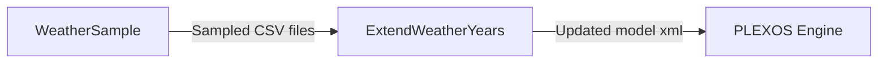

# Workflow: Generate sampled weather year inputs and register them in a PLEXOS model

## Usecase
You have multi-year weather profile CSVs (for example wind and solar) stored under your study workspace, and you need to run a multi-year PLEXOS simulation horizon using a consistent set of climate-year samples. You want the sampled time series written as per-location CSVs and then registered into your PLEXOS model database so the study can reference them via Data File, Variable, Scenario, and Stochastic objects.

This workflow takes weather profile CSVs from `{simulation_path}`, generates sampled outputs, and updates the model database so `project.xml` is regenerated with the new inputs.

## Problem
Without automation, you typically have to manually slice and align climate-year data to your simulation horizon, generate many per-location files, and then hand-wire those files into the PLEXOS database (Data Files, Variables, Scenario grouping, and stochastic sample counts). That manual process is slow, easy to misconfigure (wrong year range, wrong object names, missing links), and hard to repeat consistently across studies and reruns.

## Data Flow Diagram


## Scripts Involved

| Order | Script | Phase | Purpose | Key Arguments |
|---:|---|---|---|---|
| 1 | [WeatherSample](../Pre/PLEXOS/WeatherSample/README.md) | Pre | Generate per-location sampled weather CSVs aligned to the simulation horizon | `--profiles-dir`, `--files`, `--start-date`, `--end-date`, `--min-climate-year`, `--max-climate-year` |
| 2 | [ExtendWeatherYears](../Pre/PLEXOS/ExtendWeatherYears/README.md) | Pre | Register sampled CSVs into the PLEXOS model DB and export updated `project.xml` | `--sampled-dir`, `--study-id`, `--create-variables`, `--variable-name-suffix`, `--link-variables`, `--target-class-name`, `--scenario-name`, `--scenario-read-order`, `--adjust-stochastic`, `--stochastic-object-name`, `--stochastic-parent-name`, `--start-year`, `--end-year` |

## Complete Task Definition
```json
[
  {
    "Name": "Sample weather years",
    "TaskType": "Pre",
    "Files": [
      { "Path": "Project/Study/WeatherSample/sample_weather_years.py", "Version": null },
      { "Path": "Project/Study/requirements.txt", "Version": null }
    ],
    "Arguments": "python3 WeatherSample/sample_weather_years.py --profiles-dir TimeSeries/Weather%20Profiles --files Offshore%20Wind%20Profiles%20CY1982+%20TY1.csv Onshore%20Wind%20Profiles%20CY1982+%20TY1.csv Solar%20Profiles%20CY1982+%20TY1.csv --start-date \"2025-10-01 00:00\" --end-date \"2030-12-31 23:00\" --min-climate-year 2006 --max-climate-year 2016",
    "ContinueOnError": false,
    "ExecutionOrder": 1
  },
  {
    "Name": "Register sampled weather files in PLEXOS model",
    "TaskType": "Pre",
    "Files": [
      { "Path": "Project/Study/ExtendWeatherYears/extend_weather_years.py", "Version": null },
      { "Path": "Project/Study/requirements.txt", "Version": null }
    ],
    "Arguments": "python3 ExtendWeatherYears/extend_weather_years.py --sampled-dir TimeSeries/ExoSampled --study-id 11111111-2222-3333-4444-555555555555 --create-variables --variable-name-suffix _CY --link-variables --target-class-name Generator --scenario-name Weather_Variables_CY --scenario-read-order 50001 --adjust-stochastic --stochastic-object-name Weather_Stochastic --stochastic-parent-name Model --start-year 2006 --end-year 2016",
    "ContinueOnError": false,
    "ExecutionOrder": 2
  }
]
```

## Step-by-Step Walkthrough

### 1) WeatherSample
**What it does**
- Reads one or more weather profile CSVs from the folder specified by `--profiles-dir` (resolved relative to `{simulation_path}`).
- Applies climate-year day-of-week alignment to the simulation horizon (`--start-date` to `--end-date`).
- Writes sampled outputs as per-location CSV files under `ExoSampled/<input-file-stem>/`.

**Inputs**
- `{simulation_path}/{--profiles-dir}/<each file in --files>`

**Outputs for the next step**
- Sampled per-location CSVs written under:
  - `{simulation_path}/TimeSeries/ExoSampled/<input-file-stem>/<location>.csv` (when `--profiles-dir` is `TimeSeries/Weather Profiles`)

**Environment variables**
- `simulation_path` (optional; defaults to `/simulation`)

**Failure behavior**
- Exits with code `1` if the resolved profiles directory does not exist, if any file in `--files` is missing, or if no climate years exist in the requested range.

---

### 2) ExtendWeatherYears
**What it does**
- Discovers sampled CSV files under `--sampled-dir` (resolved relative to `{simulation_path}`).
- Updates the PLEXOS model database by creating Data File objects (and optionally Variable and Scenario objects), linking them, and optionally adjusting a Stochastic object’s sample count.
- When not using `--dry-run`, exports the updated database to `project.xml` using Cloud SDK conversion.

**Inputs**
- Sampled CSV directory: `{simulation_path}/{--sampled-dir}`
- Model database:
  - If `--model-path` is provided, that path is used.
  - Otherwise it falls back to `{simulation_path}/reference.db`, then `sqlite_input_path`.

**Outputs**
- Updated model database (in place).
- `project.xml` in the same folder as the model DB (skipped when `--dry-run` is enabled).

**Environment variables**
- `cloud_cli_path` (required when DB-to-XML export is performed)
- `simulation_path` (optional; defaults to `/simulation`)
- `sqlite_input_path` (optional; used as fallback for model path)
- `study_id` (optional; fallback if `--study-id` is not provided and not using `--dry-run`)

**Failure behavior**
- Exits with code `1` if the model path cannot be resolved, the sampled directory is missing/empty, `--target-class-name` is missing while `--link-variables` is enabled, study ID is missing when export is required, or DB-to-XML conversion fails.
- Uses backup/restore behavior around `project.xml` overwrite; if conversion fails, it restores the prior state.

**SDK/CLI note**
- This step uses Cloud SDK for DB-to-XML conversion; ensure your Cloud CLI is available via `cloud_cli_path`. See [CloudSDK](../Documentation/CloudSDK.md).

## Data Flow Between Steps

### From Step 1 to Step 2
**What Step 1 writes**
- For each input profile CSV (for example `Solar Profiles CY1982+ TY1.csv`), Step 1 creates:
  - A directory: `{simulation_path}/TimeSeries/ExoSampled/<input-file-stem>/`
  - Multiple per-location CSVs: `{simulation_path}/TimeSeries/ExoSampled/<input-file-stem>/<location>.csv`

**Naming and structure**
- `<input-file-stem>` is the input filename without the `.csv` extension.
- `<location>.csv` corresponds to each location column in the input profile file.

**What Step 2 reads**
- Step 2 scans `{simulation_path}/{--sampled-dir}` and collects CSV files (including those in subdirectories).
- Each discovered CSV becomes a Data File object (and optionally a Variable object) in the model DB.

## Troubleshooting

| Symptom | Cause | Fix |
|---|---|---|
| WeatherSample exits with code `1` and logs indicate the profiles directory is missing | `--profiles-dir` does not exist under `{simulation_path}` | Verify the folder exists under `{simulation_path}` and that `--profiles-dir` is a relative path (not absolute). |
| WeatherSample exits with code `1` and logs indicate an input file is missing | A filename in `--files` does not match what is present in the profiles directory | List the directory contents and update `--files` to match exactly; if names contain spaces, pass URL-encoded values like `%20`. |
| WeatherSample exits with code `1` due to no climate years found | `--min-climate-year` / `--max-climate-year` do not overlap the years in the profile CSV | Widen the year range or confirm the profile CSV contains data for the requested climate years. |
| ExtendWeatherYears exits with code `1` and reports sampled directory missing or empty | Step 1 did not run successfully, or `--sampled-dir` points to the wrong folder | Confirm Step 1 created `{simulation_path}/TimeSeries/ExoSampled/` and set `--sampled-dir` accordingly. |
| ExtendWeatherYears exits with code `1` when `--link-variables` is enabled | `--target-class-name` was not provided | Add `--target-class-name` (for example `Generator`) when using `--link-variables`. |
| ExtendWeatherYears fails during DB-to-XML export | `cloud_cli_path` is not set or Cloud CLI is not available to the task runtime; or `--study-id` is missing when not using `--dry-run` | Set `cloud_cli_path` to the Cloud CLI executable path and provide `--study-id` (or set `study_id`). Validate Cloud SDK/CLI setup per [CloudSDK](../Documentation/CloudSDK.md). |